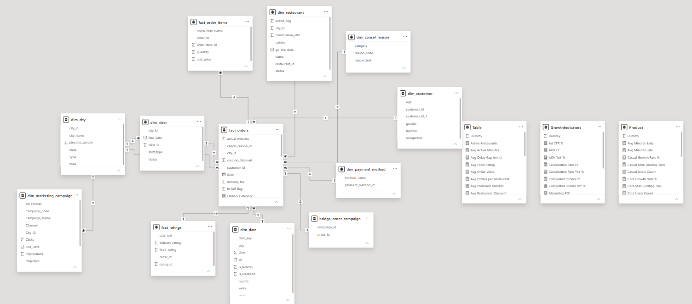

# Zippy Eats | End-to-End Power BI Data Application

**[Click here to view the Interactive Business Case Study & Executive Summary on Notion](https://app.notion.com/p/Zippy-Eats-Business-Analytics-Executive-Case-Study-3816a9efe9148038b668fd14a79569d9)**

---

## Data Consolidation & Power Query (ETL)
The raw transactional data for this project was split across multiple separate folders and broken down into individual monthly Excel workbooks. To build a clean, unified database, I performed the following engineering steps:
* **Automated File Merging:** Connected Power BI to the local source folders using folder access queries. This established an automated loop that automatically opens, extracts data from, and appends all separate monthly files into single consolidated tables.
* **Format & Type Verification:** Reviewed and corrected all column data types (such as explicitly casting dates, keys, and currency values) to ensure backend performance and eliminate calculation syntax errors.

---

## Data Modeling (Star Schema Architecture)
To keep the application running fast and ensure smooth cross-filtering across dashboard pages, I organized the dataset into a professional **Star Schema** layout.



### 1. Fact Tables (Numeric Events)
* `fact_orders`: The core transactional table containing order amounts, margins, fees, and timestamps.
* `fact_order_items`: Breaks down individual food items inside each distinct order.
* `fact_ratings`: Houses customer feedback metrics, CSAT scores, and logistics time gaps.

### 2. Dimension Tables (Filter Contexts)
* Descriptive lookup tables including `dim_city`, `dim_customer`, `dim_restaurant`, `dim_payment_method`, `dim_rider`, `dim_cancel_reason`, and a custom `dim_date` table for time-intelligence tracking.

### 3. Model Logic
* Relationships are built using standard **1-to-Many (1:*) single-directional filters**, allowing dimension tables to clean-filter the core facts without causing performance lag or cyclical circular loops.

---

## Custom DAX Metrics Catalog
All custom calculations are housed in structured metrics folders to preserve clean project architecture:

### 📊 The `Table` Folder (Core Baseline Metrics)
Tracks foundational operational performance and financial volume.
```dax
Total Orders = COUNT(fact_orders[order_id])
```
```dax
Avg Order Value = DIVIDE([Gross Order Value], [Total Orders], 0)
```

### 📈 The GrowthIndicators Folder (Time-Intelligence)
Compares current business windows against past historical periods.

```dax
Net Revenue LY = CALCULATE([Net Revenue], SAMEPERIODLASTYEAR(dim_date[Date]))
```

```dax
Net Revenue YoY % = DIVIDE([Net Revenue] - [Net Revenue LY], [Net Revenue LY], 0)
```

### 📱 The Product Folder (App Performance & Users)
Measures user adoption, growth cohorts, and retention rates.

To dynamically track customer tiers, I wrote advanced cohort segmentation formulas that analyze transaction history, app feature usage, and review submissions simultaneously:

-- 1. Power Users: Active customers using the app wallet AND submitting feedback reviews.

```dax
Power Users Count = 
COUNTROWS(
    FILTER(
        VALUES(fact_orders[customer_id]),
        CALCULATE(SUM(fact_orders[wallet_credit])) > 0 &&
        CALCULATE(COUNTROWS(fact_ratings), CROSSFILTER(fact_orders[order_id], fact_ratings[order_id], Both)) > 0
    )
)
```

-- 2. Casual Users: Low-frequency buyers (2 or fewer orders) who are not Power Users.

```dax
Casual Users Count = 
COUNTROWS(
    FILTER(
        VALUES(fact_orders[customer_id]),
        VAR HasWallet = CALCULATE(SUM(fact_orders[wallet_credit])) > 0
        VAR HasRating = CALCULATE(COUNTROWS(fact_ratings), CROSSFILTER(fact_orders[order_id], fact_ratings[order_id], Both)) > 0
        VAR IsPower = (HasWallet && HasRating)
        VAR OrderCount = CALCULATE(COUNT(fact_orders[order_id]), fact_orders[order_status] = "completed")
        RETURN OrderCount <= 2 && NOT(IsPower)
    )
)
```

-- 3. Core Users: High-frequency buyers (More than 5 orders) who are not Power Users.

```dax
Core Users Count = 
COUNTROWS(
    FILTER(
        VALUES(fact_orders[customer_id]),
        VAR HasWallet = CALCULATE(SUM(fact_orders[wallet_credit])) > 0
        VAR HasRating = CALCULATE(COUNTROWS(fact_ratings), CROSSFILTER(fact_orders[order_id], fact_ratings[order_id], Both)) > 0
        VAR IsPower = (HasWallet && HasRating)
        VAR OrderCount = CALCULATE(COUNT(fact_orders[order_id]), fact_orders[order_status] = "completed")
        RETURN OrderCount > 5 && NOT(IsPower)
    )
)
```
